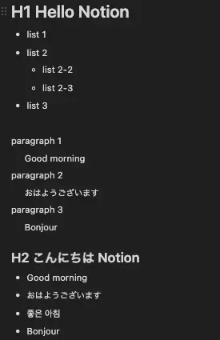
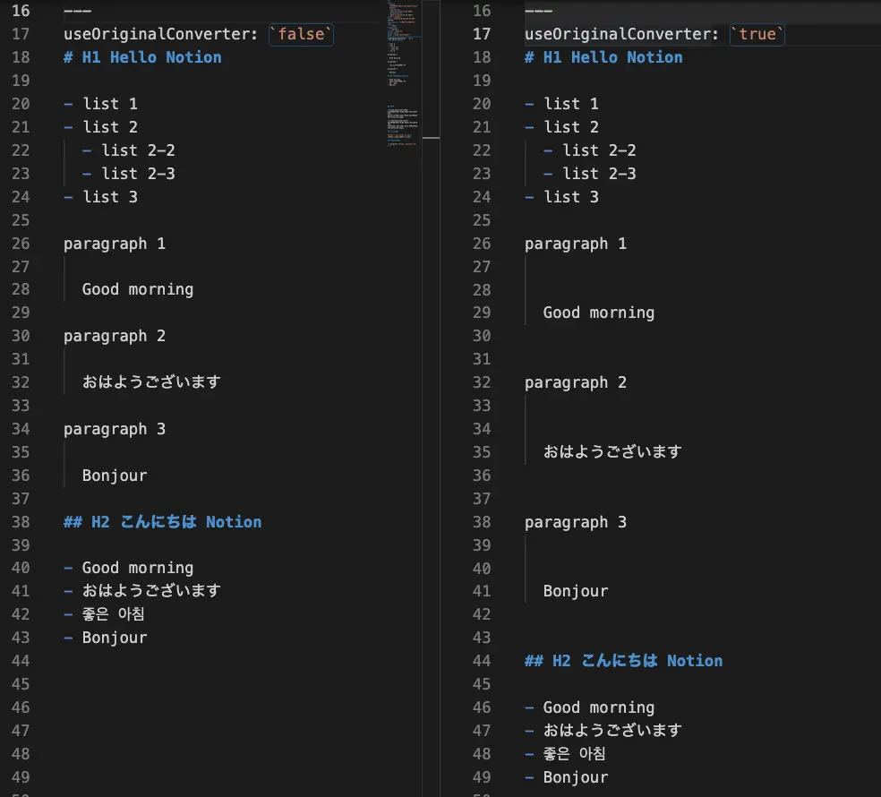

# Notion to Hugo Expoter

Use "[Notion](https://www.notion.so/product)" as a Headless CMS to generate a content file for [Hugo](https://gohugo.io/).

This software is dedicated to generating Markdown content for Hugo. After generating the content, follow the Hugo specifications.

## Features

- Get pages in any Notion database and convert them to Markdown
- Having a cache to reduce requests to the Notion API
- Stop the content generation process when you find an Amazon S3 image (Alternatively can be disable)
- Download Amazon S3 images when detected (Optional)
- Images downloaded from Amazon S3 can be automatically converted to WebP format (Optional)
- Automatically convert strings set in `Url` and `Slug` with kebab-case
- Implemented a callback that allows you to add arbitrary processing after downloading an image (See configuration for details)
- See also [other configuration available](#available-configuration-parameters)

## Permission

This library only requires Notion's Read permission.

None of your Notion Content will be modified.

## Quickstart

### 1. Setup configuration.

```bash
export NOTION_TOKEN=
export NOTION_BLOG_DATABASE_ID=
```

- `NOTION_TOKEN`: Create a secret token in "[my integrations](https://www.notion.so/my-integrations)".
- `NOTION_BLOG_DATABASE_ID`: See [this page (developers.notion.con)](https://developers.notion.com/docs/working-with-databases) for how to find your database id.
  - `https://www.notion.so/{workspace_name}/{database_id}?v={view_id}`

Then, prepare the proparty in Notion database. (See the section below for details)

### 2. Execute command with docker

```bash
docker run -it --rm \
  -e NOTION_TOKEN=$NOTION_TOKEN \
  -e NOTION_BLOG_DATABASE_ID=$NOTION_BLOG_DATABASE_ID \
  -v $(pwd)/notion-hugo.config.js:/work/notion-hugo.config.js \
  -v $(pwd)/content/:/work/content/ \
  -v $(pwd)/static/:/work/static/ \
  -v $(pwd)/.notion-hugo-cache/:/work/.notion-hugo-cache/ \
  dobassy/notion-hugo-exporter:latest
```

Mount four files or directories.

- `notion-hugo.config.js`: configuration file.
- `content/`: The directory where Hugo will place the content (Markdown) it loads.
- `static/`: The directory where the downloaded image is placed (correctly, it is set in the config).
- `.notion-hugo-cache/`: The database that caches the state of articles and images downloaded from Notion.

## Available Configuration Parameters

Below is the parameters that can be set configuration in `notion-hugo.config.js`

```js
module.exports = {
  directory: string,
  concurrency: number,
  authorName: string,
  s3ImageUrlWarningEnabled: boolean,
  s3ImageUrlReplaceEnabled: boolean,
  s3ImageConvertToWebpEnalbed: boolean,
  useOriginalConverter: boolean,
  saveAwsImageDirectory: null | string,
  downloadImageCallback: null | func(),
  customTransformerCallback: null | func(),
};
```

- `directory`: (Required) Directory for exporting pages. A directory is created for each section, but it is basically flat.
- `concurrency`: Defaults to `5`.
- `authorName`: You can uniformly set the author of the article.
- `s3ImageUrlWarningEnabled`: Defaults to `true`. If the generated Markdown file contains an Amazon S3 URL, this tool will throw an error and terminate execution, but you can disable this behavior. It is highly recommended to enable it to avoid accidentally exposing your S3 URL. It should only be used for debugging.
- `s3ImageUrlReplaceEnabled` (Experimental): Defaults to `false`. If your Notion content contains S3 URLs, replace them with local paths after downloading. This function attempts to reduce the time and effort required for image management.
- `s3ImageConvertToWebpEnalbed`: Defaults to `false`. Converts downloaded images to Webp format.
- `useOriginalConverter`: Defaults to `false`. See the [Adjust blank lines in paragraphs](#adjust-blank-lines-in-paragraphs) section for details.
- `utcOffset`: Defaults to `null` as "`Z`". If you don't set the content publish time, it will be exported as 12:00 AM, but you can specify the time zone offset that will be used at that time (e.g. "`+09:00`").
- `saveAwsImageDirectory`: Defaults to `null`. Images uploaded to Notion's pages are stored on Amazon S3, but the public URL has an 3600s limit. This is incompatible with generators that generate static HTML like Hugo. Therefore, you should upload it to some external storage and then embed the URL in the Notion's page. Enabling this option will make your work a little eaiser as the software will download the images.
- `downloadImageCallback`: Defaults to `null`. If you want to use the downloaded image for addition processing, you can implement a callback. For example, an example implementation for uploading an image to WordPress (using REST API) can be found in `notion-hugo.config.02callback-sample.js`
- `fetchInterval`: Only available in server mode. See "Watch mode (Server mode)" for more information. Defaults to `30`.
- `customTransformerCallback`: See also https://github.com/souvikinator/notion-to-md#custom-transformers

## Local build

Currently, this software is not published to the NPM registry. You need local build.

### Step 1. Prepare the command

Set up a link to your local environment.

```bash
git clone ...
npm install
npm link
```

### Step 2. Set environment

Set two environment variables to access the Notion.

```bash
NOTION_BLOG_DATABASE_ID=
NOTION_TOKEN=
# Notion tokens can be read-only role
```

### Step 3. Configuration

Create a config file.

```bash
cp notion-hugo.config.01sample.js notion-hugo.config.js

# Or if you need a custom process after downloading the image
cp notion-hugo.config.02callback-sample.js notion-hugo.config.js
```

### Step 4. Prepare the proparty in Notion database

Notion database property keys must be:

| Property Name   | Type                 | Required                                 | Default value |
| --------------- | -------------------- | ---------------------------------------- | ------------- |
| isPublished     | Boolean              | ✅                                       |
| Category        | Select               | ✅                                       |
| Tags            | multi_select         | ✅                                       |
| PublishedAt     | date                 | ✅                                       |
| UpdatedAt       | date                 | ✅                                       |
| Url             | Text                 | ✅ (Either Url or Slug)                  |
| Slug            | Text                 | ✅ (Either Url or Slug)                  |
| ~~LegacyAlert~~ | Boolean              | (Removed mandatory constraint from v0.5) |
| Description     | Text                 | ✅                                       |
| Image           | Image (external url) | ✅                                       |
| ~~ToC~~         | Boolean              | (Removed mandatory constraint from v0.5) |
| Section         | Select               | ✅                                       |
| Author          | Text or Select       |                                          | "Writer"      |
| isDraft         | Boolean              |                                          | false         |
| filepath        | Text                 |                                          |               |

- Currently, these keys **must be set manually**.
- `filepath` property: Normally, the filename is automatically generated from Section and PageID (generated by Notion), but it can be overriden by specifying the absolute path.

#### Optional Properties.

| Property Name | Type   |
| ------------- | ------ |
| linkTitle     | Text   |
| weight        | Number |

These properties will be used in [Docsy](https://www.docsy.dev/) theme.

#### Custom (User defined) Properties.

You can set any number of options that will be exported to Frontmatter.

```js
// array[0]: property name in Notion
// array[1]: Types identified when exporting to Frontmatter (Markdown)
customProperties: [
  ["ToC", "boolean"],
  ["AdditionalDescription", "text"],
],
```

In the above example:

- A checkbox property set with the name 'ToC' in Notion recognizes it as a Boolean
- A text propety set with the name 'AdditionalDescription' in Notion recognizes it as a Text (Stgin)

Currently, type (`array[1]`) can be set to two types: `boolean` or `text`

### Step 5. Run

Finally, exec command.

```bash
$ notion-hugo

 or

$ notion-hugo --force
```

This CLI is developed on Node v18.12.x

(Presumably earlier versions will also work)

## Example for exported contnet


### FrontMatter

```yml
---
sys:
  pageId: "01234567-0123-4567-8901-dummy1dummy2"
  createdTime: "2022-02-01T15:54:00.000Z"
  lastEditedTime: "2022-02-01T15:56:00.000Z"
title: "Example page"
date: "2022-02-01T00:00:00.000+09:00"
description: "Description here"
tags:
  - "API"
  - "Development"
categories:
  - "Notion"
toc: true
author: "Writer"
legacy_alert: false
draft: false
url: "/hugo-notion-example-page"
section: "technologies"
---
# Hugo Notion

hello, world
```

### Body

The Markdown body generated by thid program is heavily dependent on the "notion-to-md" library.

[souvikinator/notion-to-md: Convert notion pages, block and list of blocks to markdown (supports nesting)](https://github.com/souvikinator/notion-to-md)

## Caching

Cache the last modified date of a Notion's page with Notion's pageId as the primary key.

To minimize the number of request to the Notion API, we cache the date and time of the retrieved pages. Delete the `.notion-hugo-cache/` directory if you want to initialize it.

## Customize according to the property type

You can define your own custom transformer for a notion type.

**CustomTransformer** is a feature provided by the `notion-to-md` library. Seed the [official document](https://github.com/souvikinator/notion-to-md) for more details.

It can be optionally implemented in the `notion-hugo.config.js` file as shown bellow.

```js
const customTransformerCallback = (n2m) => {
  n2m.setCustomTransformer("bookmark", async (block) => {
    const { bookmark } = block;
    if (!bookmark?.url) return "";
    return `\{\{<blogcard "${bookmark.url}">\}\}`;
  });
};
```

Original output:

```md
[bookmark](https://github.com/)
```

After transform output:

```

```

Useful when converting to Hugo's shortcode.

## Adjust blank lines in paragraphs

Due to the specification change in [notion-to-md version 2.5.1](https://github.com/souvikinator/notion-to-md/releases/tag/v2.5.1), multiple line breaks have been inserted in paragraphs. It's a matter of taste, but we have customized it to handle the number of line breaks in paragraphs according to the conventional specifications. Future updates to the library may make this feature obsolete.

If you want to use the original library specification, you can change the behavior by setting the setting to `true`.

- `useOriginalConverter: true`

See the image bellow for an example.

Page content in Notion:



Output results when the setting is enabled (right side) and disabled (left side):



## Watch mode (Server mode)

Exporting Notion pages can be time consuming, so running command one by one can be tedious. You can use the `--server` option to enter watch mode.

In this mode, Notion updates are checked periodically and a page is generated. By using it together with Hugo's `hugo server`, you can use it like a real-time preview.

It's even more useful for process managers such as Foreman and Hivemind. The following is a example of how to configure Procfile.

```procfile
notion: notion-hugo -S
hugo: hugo server --ignoreCache --buildFuture
```

In watch mode, **the S3 image download function does not work**. This is because many changes are assumed during the editing process.

## Inspired by

This program is influenced by the design philosophy of the contentful-hugo library.

`contentful-hugo` is an easy-to-use library for generating Hugo content from Contentful CMS. Special thanks to @ModiiMedia

- [ModiiMedia/contentful-hugo: A CLI tool that pulls data from Contentful and turns it into markdown files for Hugo and other static site generators. It also includes an express server that can be used for local development and content previews](https://github.com/ModiiMedia/contentful-hugo)
